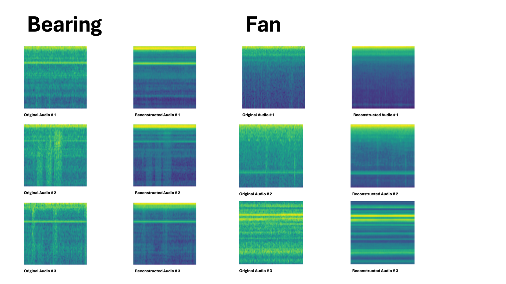
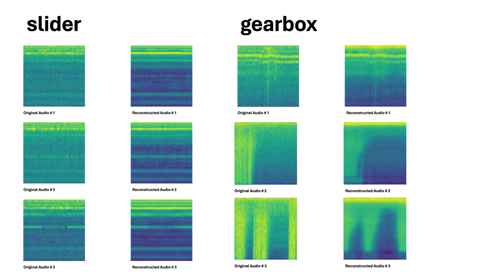

# Unsupervised Anomalous Sound Detection with Denoising Autoencoder for Small-Scale Noisy Audio

## Abstract
Detecting anomalous machine sounds without labeled or clean data presents a critical challenge in real-world industrial environments. These scenarios often involve noisy recordings, minimal supervision, and limited resources. We propose an unsupervised learning framework that uses only noisy recordings of normal machine operations, requiring no manual labels or clean ground truth. My method employs a semi-denoising autoencoder trained on approximately 1,000 noise-corrupted audio samples per machine type. By reconstructing clean-like representations, the system becomes robust to noise, data scarcity, and domain variation. This enables practical deployment in on-site industrial monitoring systems where collecting clean or anomalous data is infeasible.

## Contributions

Noisy-only Learning: The system learns from realistic noisy recordings.

Small-Data Suitability: Effective performance with only ~1,000 samples.

Robust Representation: Clean-like reconstructions enhance anomaly separation.

Unsupervised Simplicity: No manual labeling or domain-specific tuning needed.

## 1. Introduction

In real-world monitoring tasks, collecting clean, labeled, or anomalous data is often impractical. We address this by designing a method that learns from noisy normal-only audio data, operating under the constraints of no ground-truth labels, small dataset size (~1,000 samples), and high domain variability.

My contributions:

An unsupervised training strategy that models only normal behavior.

A semi-denoising autoencoder that reconstructs clean-like spectrograms.

An approach suitable for small-scale datasets and low-resource environments.

## 2. Method

### 2.1 Semi-Denoising Autoencoder

We build a convolutional autoencoder with residual U-Net architecture. The model is trained on noisy spectrograms of normal machine sounds, learning to suppress background noise while preserving structural characteristics. This facilitates clearer modeling of normal patterns without requiring clean ground truth.
[Img 1 : Model Architecture Image]
[Img 2 : Residual Block Architecture Image]

### 2.2 Unsupervised Training

The model is optimized solely on reconstruction loss.

No anomalous, clean, or labeled data is required.

Learning focuses on consistent features across noisy normal inputs.
[Img 3 : Pair Audio Training Method (7(noisy audio pair -> for learning machine audio's features) : 3(original audio pair -> reconstruct original audio))]

## 3. Evaluation Protocol

Training exclusively on noisy-normal data.

Evaluation on previously unseen machine types or environments.

Metrics: Anomaly score derived from reconstruction error.

## 4. Experiments

I evaluated my system under realistic industrial scenarios using only noisy–normal audio and a small dataset. All experiments utilize the DCASE 2025 Task 2 Development Dataset.

### 4.1 Dataset and Motivation
	•	Dataset: DCASE 2025 Task 2 Development Dataset including fan, gearbox, bearing, slide-rail, valve, ToyCar, and ToyTrain. Each clip is a single-channel 10–12 s recording at 16 kHz, containing machine sounds mixed with environmental noise.  
	•	Rationale for Selection:
	•	Aligns with my design constraints: unsupervised training using only normal samples.
	•	Data Split per Machine Class: 990 source-domain normal clips for model training. 10 target-domain normal clips to cover domain shifts.
	•	100 normal + 100 anomalous clips reserved for testing.

### 4.2 Training Configuration (Hyperparameters)
	•	Machine Classes: slider, bearing, fan, gearbox
	•	Batch size: 16
	•	Noise-to-noise augmentation pairs: 10 per audio
	•	Input format: Spectrogram images resized to 256×256
	•	Training epochs: 100 epochs for all classes except slider, which used 65 epochs to prevent over-denoising.

### 4.3 Evaluation
[Need to fix...]

## 5. Results(Qualitative Visualization)
I present qualitative results using spectrograms of four machine types: Slider, Gearbox, Bearing, and Fan. Each figure includes the original noisy input (left) and the reconstructed output (right) for three different audio samples per class.

Bearing & Fan

In the second image, Bearing class samples show clear signal lines with noise reduction, highlighting consistent feature extraction even under noisy input conditions. The reconstructions reveal that the model emphasizes harmonically relevant areas.

For Fan, the results exhibit stable, low-frequency patterns being preserved across time, while background ambient noise is significantly reduced. This demonstrates the model’s ability to handle stationary and broadband signals in noisy environments.

These visualizations validate that our model can reconstruct clean-like features from noisy audio across various machine types, providing discriminative power for anomaly detection even without clean data.

Slider & Gearbox

In the first image, for Slider, the model successfully suppresses background noise and retains steady harmonic components. However, we observed that over-denoising during training (especially after 70+ epochs) may remove machine-specific texture. To prevent this, we stopped training at 65 epochs for this class.

For Gearbox, the reconstructed spectrograms demonstrate significant denoising effects, particularly around abrupt noise bursts. The structure of rotational components remains clearly preserved, improving robustness in anomaly detection.

## 6. Conclusion

My framework provides a lightweight and unsupervised approach to anomalous sound detection that is practical for real-world deployment. It is particularly beneficial in industrial settings where collecting clean or anomalous data is difficult or impossible. By learning robust representations from noisy, unlabeled recordings, my model eliminates the need for expensive data curation and manual labeling. This makes it ideal for integration into edge devices and on-site monitoring systems, enabling early fault detection and reducing maintenance costs with minimal infrastructure. In summary, my method offers an effective and scalable solution for low-resource anomaly detection in complex environments.

