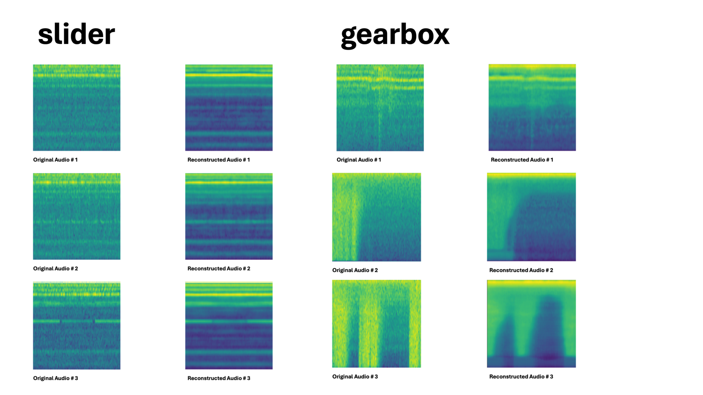

# Unsupervised Anomalous Sound Detection with Denoising Autoencoder for Small-Scale Noisy Audio

## Abstract
Detecting anomalous machine sounds without labeled or clean data presents a critical challenge in real-world industrial environments. These scenarios often involve noisy recordings, minimal supervision, and limited resources. We propose an unsupervised learning framework that uses only noisy recordings of normal machine operations, requiring no manual labels or clean ground truth. My method employs a semi-denoising autoencoder trained on approximately 1,000 noise-corrupted audio samples per machine type. By reconstructing clean-like representations, the system becomes robust to noise, data scarcity, and domain variation. This enables practical deployment in on-site industrial monitoring systems where collecting clean or anomalous data is infeasible.

## Contributions

Noisy-only Learning: The system learns from realistic noisy recordings.

Small-Data Suitability: Effective performance with only ~1,000 samples.

Robust Representation: Clean-like reconstructions enhance anomaly separation.

Unsupervised Simplicity: No manual labeling or domain-specific tuning needed.

## 1. Introduction

In real-world monitoring tasks, collecting clean, labeled, or anomalous data is often impractical. We address this by designing a method that learns from noisy normal-only audio data, operating under the constraints of no ground-truth labels, small dataset size (~1,000 samples), and high domain variability.

My contributions:

An unsupervised training strategy that models only normal behavior.

A semi-denoising autoencoder that reconstructs clean-like spectrograms.

An approach suitable for small-scale datasets and low-resource environments.

## 2. Method

### 2.1 Semi-Denoising Autoencoder

We build a convolutional autoencoder with residual U-Net architecture. The model is trained on noisy spectrograms of normal machine sounds, learning to suppress background noise while preserving structural characteristics. This facilitates clearer modeling of normal patterns without requiring clean ground truth.
[Img 1 : Model Architecture Image]
[Img 2 : Residual Block Architecture Image]

### 2.2 Unsupervised Training

The model is optimized solely on reconstruction loss.

No anomalous, clean, or labeled data is required.

Learning focuses on consistent features across noisy normal inputs.
[Img 3 : Pair Audio Training Method (7(noisy audio pair -> for learning machine audio's features) : 3(original audio pair -> reconstruct original audio))]

## 3. Evaluation Protocol

Training exclusively on noisy-normal data.

Evaluation on previously unseen machine types or environments.

Metrics: Anomaly score derived from reconstruction error.

## 4. Experiments

We evaluated our denoising-based anomaly detection system under realistic industrial conditions, following the official DCASE 2025 Task 2 setting. All experiments were conducted using the DCASE 2025 Task 2 Development Dataset.

### 4.1 Dataset and Motivation

- **Dataset**: The DCASE 2025 Task 2 Development Dataset includes machine types such as fan, gearbox, bearing, slider, valve, ToyCar, and ToyTrain. Each audio clip is a single-channel recording (10–12 s, 16 kHz) containing machine operation sounds under real-world noisy environments.

- **Rationale for Dataset Choice**:
  - The dataset matches the unsupervised learning requirement: only normal (non-anomalous) audio is used during training.
  - **Training (source-domain)**: 990 normal clips per machine type
  - **Domain shift adaptation (target-domain)**: 10 normal clips per machine type
  - **Testing**: 100 normal + 100 anomalous clips per machine

### 4.2 Training Configuration

- **Machine Classes Used**: slider, bearing, fan, gearbox
- **Batch Size**: 16
- **Noise-to-Noise Augmentation**: 10 augmented noisy-normal pairs per clip
- **Input Format**: Spectrogram images resized to 256 × 256
- **Epochs**: 100 for all classes, except 65 for the slider class (to avoid over-denoising)
- **Denoising Model**: Custom U-Net autoencoder trained separately for each machine class
- **Anomaly Detection Model**: *Official DCASE 2025 Task 2 Baseline Model*, unchanged
- **Evaluation Metric**: AUC, AUC_target, and pAUC (as defined in the official DCASE baseline)

### 4.3 Evaluation Results

**Observations**:
- Using denoised audio generally preserved or improved the model's source-domain detection performance (e.g., `fan`, `ToyCar`).
- Improvements were especially evident in machine types sensitive to background noise patterns.
- Target-domain results show slight variance, implying that denoising may affect domain generalization differently per class.

### 4.4 Hardware Configuration

All experiments were conducted on a local workstation with the following specifications:

- **OS**: Ubuntu 22.04.5 LTS (64-bit)
- **CPU**: AMD Ryzen 7 7800X3D (8 cores @ 5.05GHz)
- **GPU**: NVIDIA GeForce RTX 5060TI(×2, dual-GPU)
- **RAM**: 64 GB
- **Kernel**: Linux 6.8.0-60-generic

## 5. Results(Qualitative Visualization)
I present qualitative results using spectrograms of four machine types: Slider, Gearbox, Bearing, and Fan. Each figure includes the original noisy input (left) and the reconstructed output (right) for three different audio samples per class.

Bearing & Fan

In the second image, Bearing class samples show clear signal lines with noise reduction, highlighting consistent feature extraction even under noisy input conditions. The reconstructions reveal that the model emphasizes harmonically relevant areas.

For Fan, the results exhibit stable, low-frequency patterns being preserved across time, while background ambient noise is significantly reduced. This demonstrates the model’s ability to handle stationary and broadband signals in noisy environments.

These visualizations validate that our model can reconstruct clean-like features from noisy audio across various machine types, providing discriminative power for anomaly detection even without clean data.

Slider & Gearbox

In the first image, for Slider, the model successfully suppresses background noise and retains steady harmonic components. However, we observed that over-denoising during training (especially after 70+ epochs) may remove machine-specific texture. To prevent this, we stopped training at 65 epochs for this class.

For Gearbox, the reconstructed spectrograms demonstrate significant denoising effects, particularly around abrupt noise bursts. The structure of rotational components remains clearly preserved, improving robustness in anomaly detection.

## 6. Conclusion
My framework delivers an efficient, unsupervised solution for anomalous sound detection designed for practical, real-world deployment—especially in industrial environments where access to clean or anomalous recordings is limited or impossible.
By learning from noisy, unlabeled normal data, the system avoids costly data collection and manual labeling, while generating robust feature representations that generalize across varied conditions.

Leveraging DCASE 2025 Task 2’s “first‑shot” scenario, the method supports domain-shift resilience, handling new operating environments with minimal calibration.
It’s a lightweight architecture, optimized for edge deployment, enabling on-site real-time fault detection without reliance on expensive infrastructure.
This leads to faster detection of machine issues, lower maintenance costs, and improved operational uptime—all while maintaining a small computational footprint.